# How to use this app

開発や動作確認にあたってハマった点や注意点をまとめます。

## 起動後 よくあるエラー

以下エラーが出た場合

```json
error: {
      type: 'insufficient_quota',
      code: 'insufficient_quota',
      message: 'You exceeded your current quota, please check your plan and billing details. For more information on this error, read the docs: https://platform.openai.com/docs/guides/error-codes/api-errors.',
      param: null
    }
```

Open AIダッシュボードにアクセスして、BillingのCredit残高がゼロになっていないことを確認してください。（既に検証などを行っていると、初回の割り当てを使い切っている可能性があります。）

## Web Search＋Code Interpreter＋Functions
右サイドバーの以下を有効にした上で、「東京のN月の気温を取得し、それをプロットしたグラフを生成できますか？」と入力する。
- Web search
- Code interpreter
- Functions
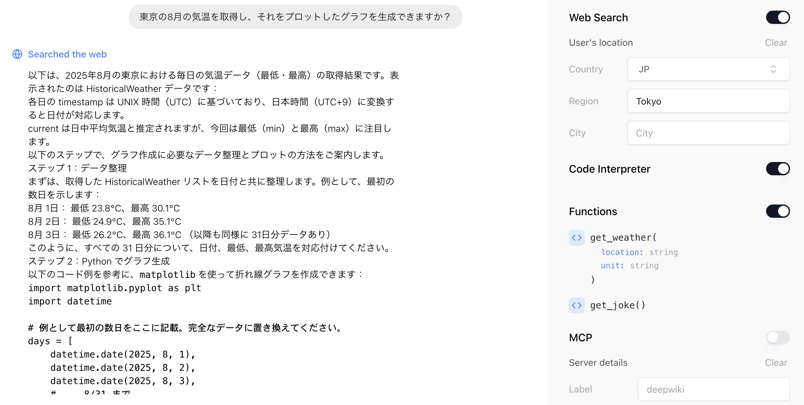
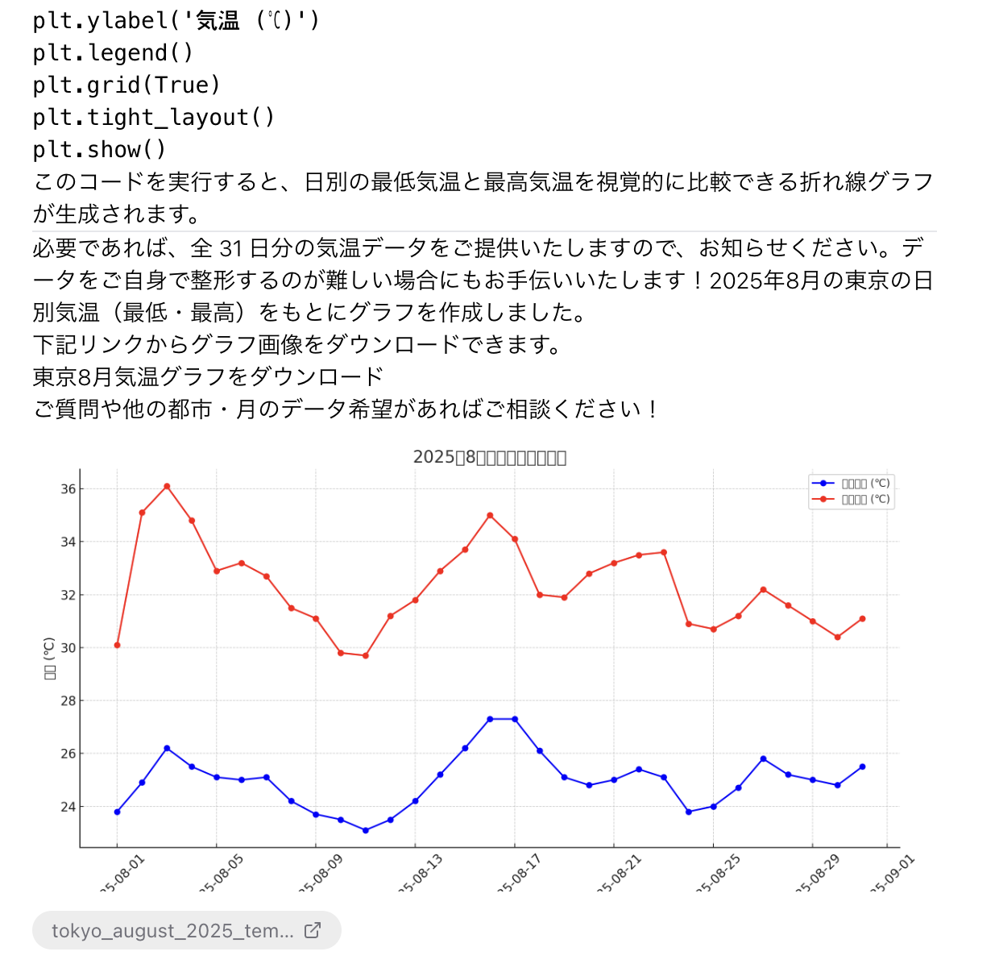

ChatGPTのsearch、Code Interpreterを使用して、アプリ上で高度な検索・処理を実行できます。

## Google統合

### Google Cloudでの設定

以下の流れで設定してください。

Google Cloud で、[API とサービス] > [Google Auth プラットフォーム] > [クライアント] > [クライアントの作成] > [Web]に移動します。
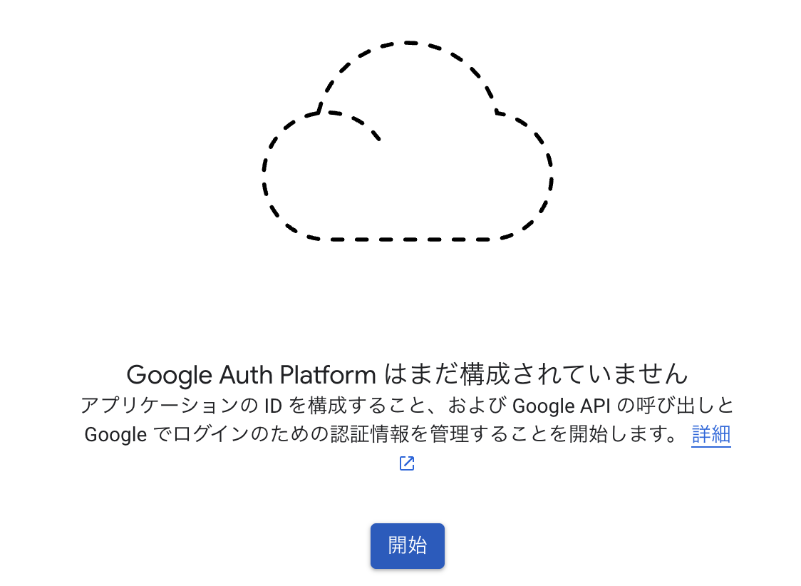
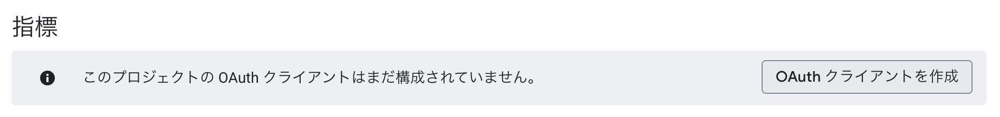

リダイレクト URI を追加します: http://localhost:3000/api/google/callback
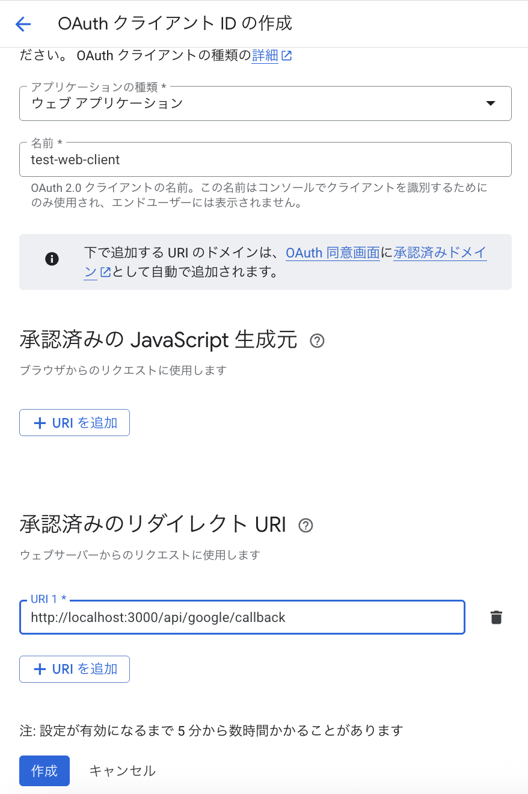

クライアントを作成すると、クライアントIDとクライアントシークレットが表示されます。コピーして.envファイルに設定します。

以下のAPIを有効化します。
- Gmail API
- Google Calendar API

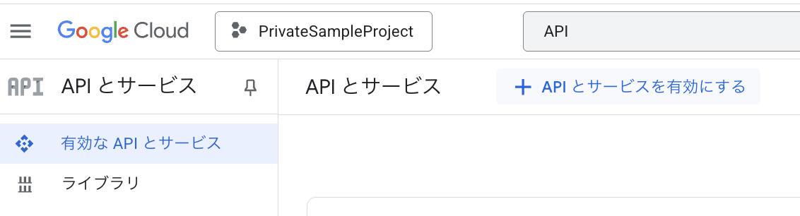
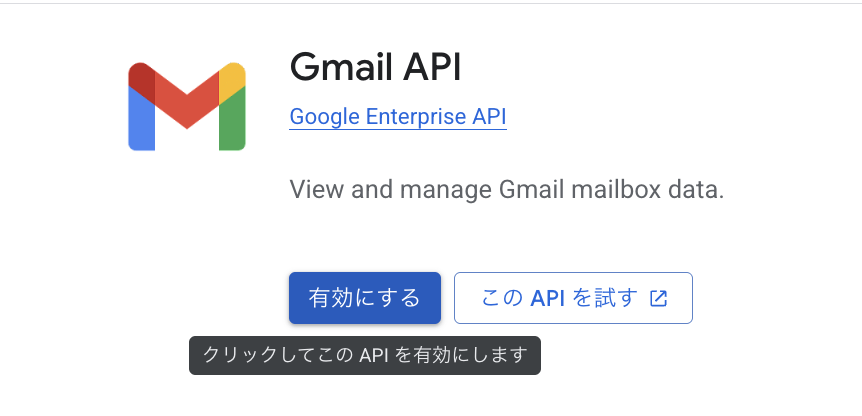

有効化を押下すると、以下のように表示されます。
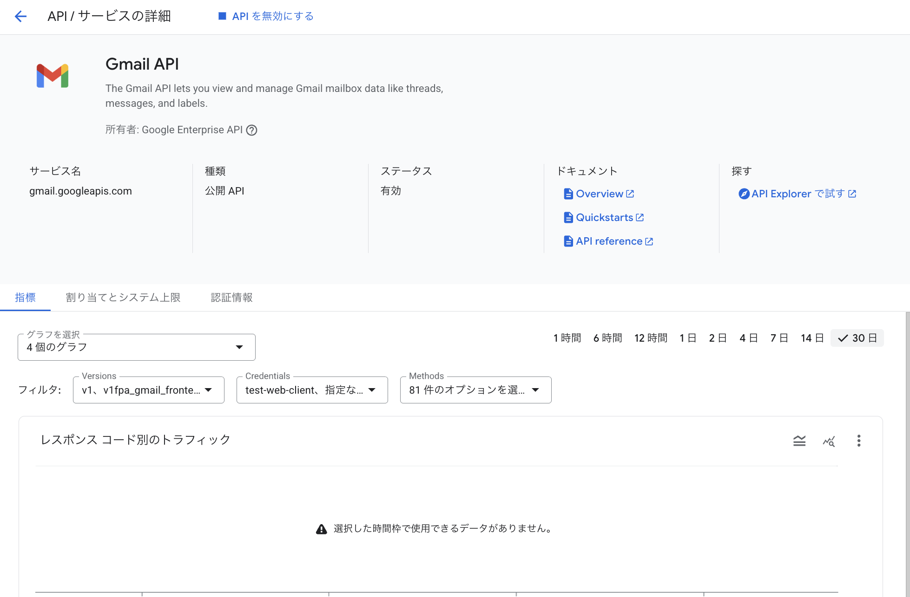

同じ手順で、カレンダーAPIも有効化します。
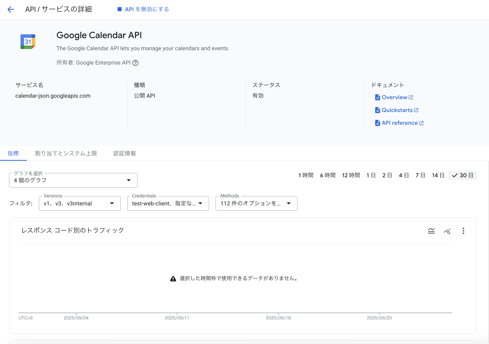

Oauthのスコープを絞ります。
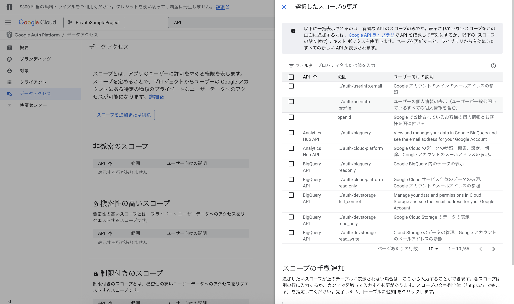

スコープの手動追加に以下を貼り付けて、追加を押下します。すると、指定の5つが自動的に適切なスコープに対して割り当てられます。
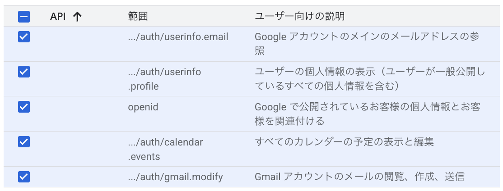
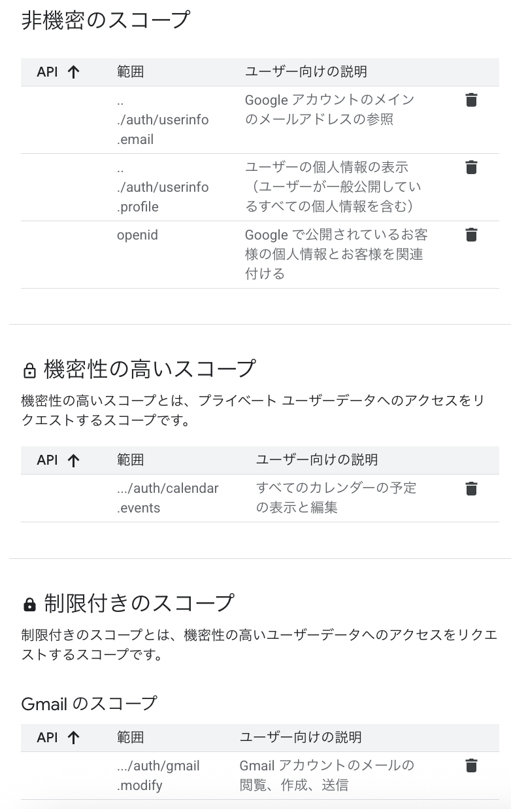

この段階だと、まだ審査プロセスを完了してないため、以下のようにブロックされます。
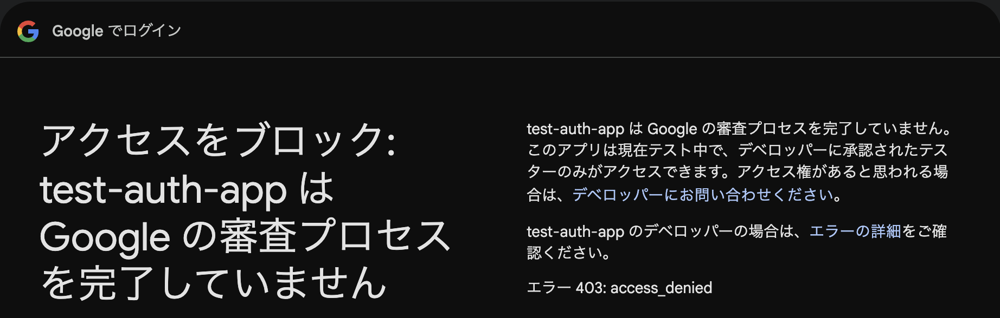

以下のように、対象 から、テストユーザーを追加します。（自分のGmailアカウントを追加しましょう。）
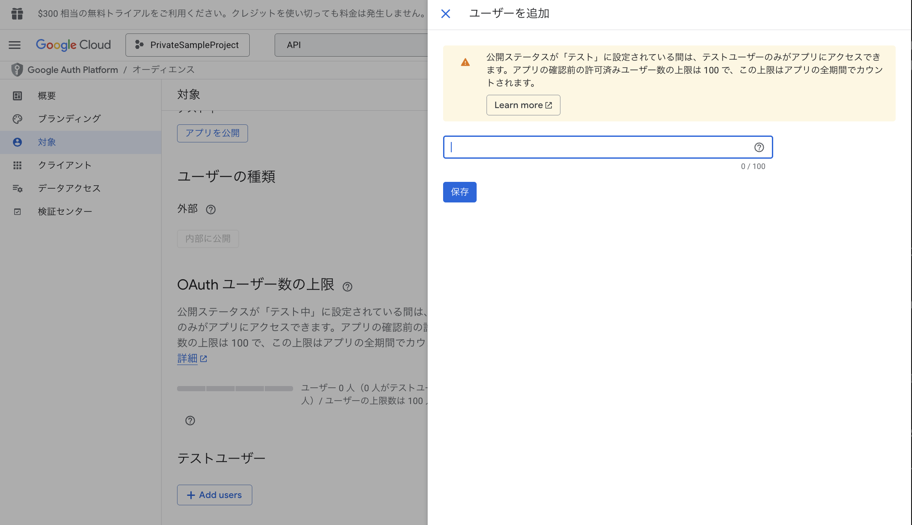

### Google統合を試す

右サイドバー末尾の、Google IntegrationのトグルをONにして、「Connect Google Integration」をクリックします。
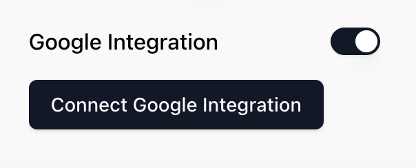

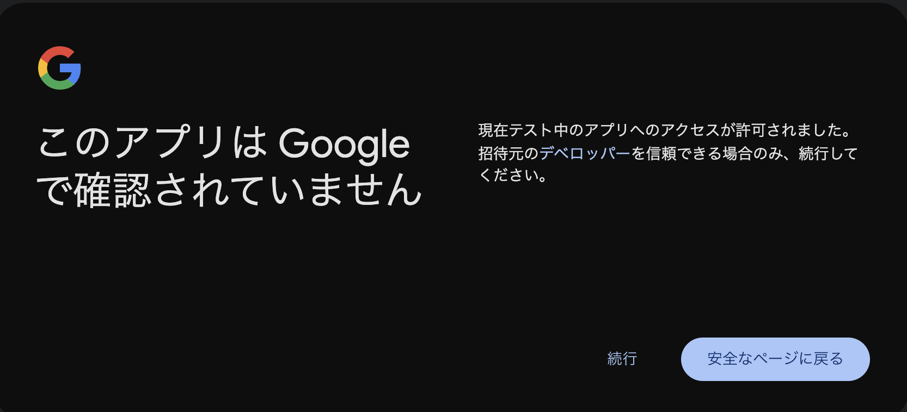

以降に表示される「次へ」「続行」は全て選択して、ログインを完了させます。正常にログインできると、以下のように表示されます。（表示されない場合には、再度試してください。）
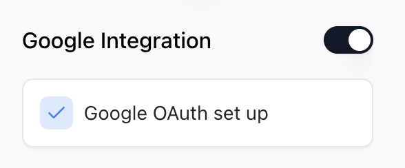

以下のようなメッセージ投稿をして、GmailやGoogle Calendarの情報を取得できることを確認してください。

- 「直近3日間に受信したメールについて、サマリしてください」
- 「今日から1週間の予定をリストアップしてください」
  - アカウント直接でない予定を取得する場合には、Googleカレンダーの設定から確認できるカレンダーID（例: abcdefg1234567@group.calendar.google.com）を指定してください。

以上
